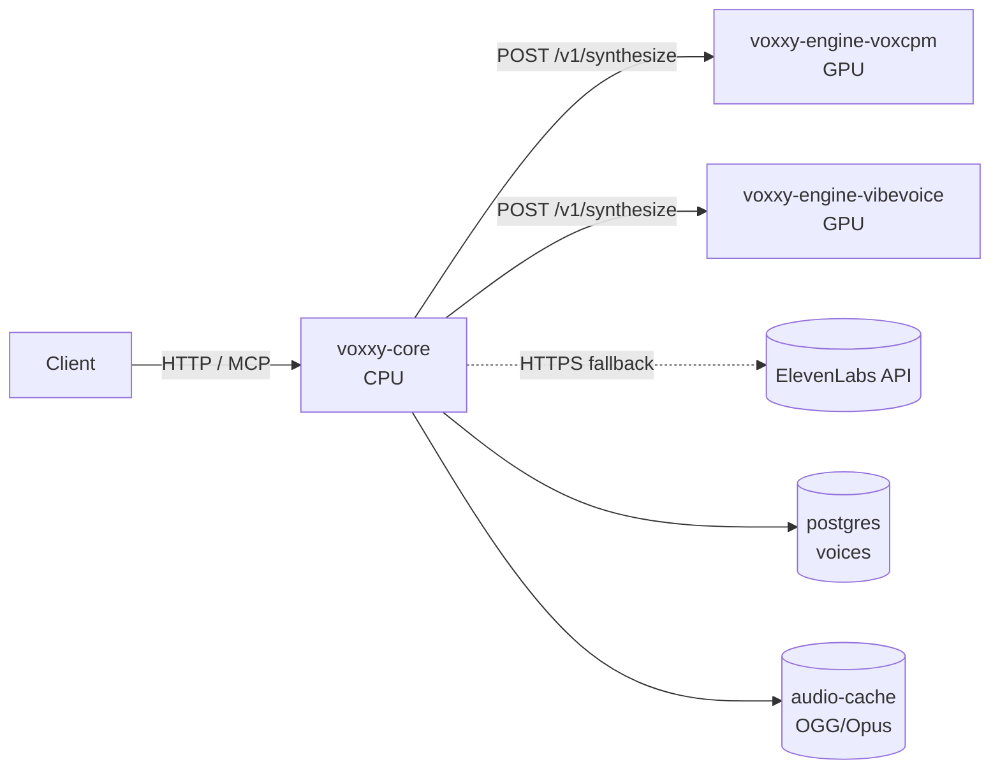

# voxxy — universal TTS service

A small FastAPI + FastMCP front-end that unifies multiple local TTS engines
(`voxcpm`, `vibevoice`) plus ElevenLabs as an automatic remote fallback, with
a postgres-backed voice profile store and a disk-backed OGG/Opus URL cache.
One logical service, three transports, every delivery surface:

- **OpenClaw / Hermes / Claude Code** via MCP (`vox:speak_url` → Telegram sendVoice, `vox:speak` for inline bytes)
- **Node-RED** via the `node-red-contrib-vox` package
- **Anything else** via HTTP `POST /synthesize` (WAV bytes) or `POST /synthesize-url` (OGG/Opus URL)

Engines live in their own containers so their dep trees (voxcpm vs
transformers+VibeVoice) don't collide and VRAM allocation is per-engine. Core
is CPU-only — no GPU libraries in the transport image.

See [`docs/specs/engine-decoupling.md`](./docs/specs/engine-decoupling.md) for
architectural depth.

## Architecture



ASCII fallback (same topology):

```
           HTTP/MCP
 Client ─────────────▶ voxxy-core (CPU)
                         │  ├─ POST /v1/synthesize ─▶ voxxy-engine-voxcpm (GPU)
                         │  ├─ POST /v1/synthesize ─▶ voxxy-engine-vibevoice (GPU)
                         │  └─ HTTPS ─ ─ ─ ─ ─ ─ ─ ▶ ElevenLabs API (remote fallback)
                         ├─▶ postgres (voices)
                         └─▶ audio-cache (OGG/Opus, TTL-swept)
```

The orchestrator tries engines in `VOX_ENGINES` order, first success wins.
ElevenLabs is always appended last when `ELEVENLABS_API_KEY` is set. Every
response carries an `engine` field (and `X-Vox-Engine` header on
`/synthesize-url`) so callers can see which engine served the request.

## Layout

```
.
├── app/                    voxxy-core (CPU-only transport + routing)
│   ├── main.py             FastAPI + MCP mount + lifespan
│   ├── engines.py          RemoteEngineClient + orchestrator + ElevenLabs
│   ├── engine_contract.py  pydantic models shared with engines
│   ├── audio.py            WAV → OGG/Opus transcode via ffmpeg
│   ├── cache.py            short-lived disk cache for /audio/<id>.ogg
│   └── voices.py           asyncpg repo + Voice dataclass
├── engines/
│   ├── voxcpm/             voxcpm engine container (GPU)
│   └── vibevoice/          vibevoice engine container (GPU)
├── voices/                 reference WAVs (bind-mounted; core ships them inline to engines)
├── audio-cache/            OGG blobs served at /audio/<id>.ogg (TTL'd, gitignored)
├── node-red-contrib-vox/   custom Node-RED node
├── scripts/                shell CLIs (vox-speak, verify-engine-contract)
├── migrations/             numbered SQL migrations applied against host postgres
├── init.sql                fresh-install schema for host postgres db `vox`
├── Dockerfile              core image (python:3.12-slim, ffmpeg, no CUDA)
├── compose.yml             voxxy-core (Traefik-facing)
├── compose.engines.yml     overlay: voxxy-engine-voxcpm + voxxy-engine-vibevoice
├── mise.toml               mise task definitions (thin aliases over voxxy CLI)
├── .env.example
└── docs/specs/             architecture + protocol docs
```

## Prereqs

- Host postgres with db `vox`, user `$DEFAULT_USERNAME` (schema applied via `init.sql` + `mise run migrate`).
- Docker nvidia runtime for engine containers. `docker run --rm --gpus all nvidia/cuda:12.4.1-base nvidia-smi` should work.
- Traefik stack running on the `proxy` docker network (standard setup here).
- Model weights cached in `~/.cache/huggingface` — bind-mounted into both engine containers so rebuilds don't re-download.

## Quick start

`voxxy` is the primary operator surface. It wraps `docker compose` + `op run`
so 1password secrets never land plaintext on disk, and it persists per-project
state (current engine order, last change) in `.voxxy.state.json`.

```bash
# Bootstrap once per workstation (prereq check, config, shell completions)
voxxy daemon install --completions

# Bring up the full stack (voxcpm primary, vibevoice secondary, elevenlabs fallback)
voxxy daemon start
voxxy health

# Speak something
voxxy speak "hello world"

# List available voices
voxxy voice list

# Clone a voice from an audio clip (interactive)
voxxy voice add /path/to/clip.wav
```

Mise task equivalents (`mise run up`, `mise run health`, `mise run smoke`, …)
remain supported as thin aliases that call `voxxy` internally. `scripts/vox-speak`
is preserved as a compat shim for existing ssh pipelines — it `exec`s into
`voxxy speak` with the same flag surface.

If `voxxy` isn't available (minimal machine, CI, debugging), raw compose still
works: populate `.env` from `.env.example` and run

```bash
docker compose -f compose.yml -f compose.engines.yml up -d --build
```

Healthcheck either way: `curl https://vox.delo.sh/healthz` or `voxxy health`.

## CLI reference

Full command tree (grouped by sub-app). See `voxxy --help` / `voxxy <group> --help`
for flags + descriptions.

```
voxxy daemon start [--core-only]     bring up stack (restores persisted engine order)
voxxy daemon stop                    stop all containers
voxxy daemon restart                 recreate voxxy-core after app/ edits
voxxy daemon reset                   destructive: stop + wipe audio-cache (voices preserved)
voxxy daemon status                  container + engine health table
voxxy daemon install [--completions] bootstrap: prereqs, config, shell completions

voxxy engine list                    ready state, VRAM, capabilities per engine
voxxy engine use <name>              make <name> primary; persists + recreates core
voxxy engine enable <name>           append to chain if absent
voxxy engine disable <name>          drop from chain
voxxy engine logs <name>             docker logs -f voxxy-engine-<name>

voxxy voice list                     all voices with tags, duration, ref paths
voxxy voice info <name>              full detail for one voice
voxxy voice add <path> [flags]       preprocess + prompt + upload (interactive)
voxxy voice delete <name> [--yes]    remove voice (prompts unless --yes)

voxxy speak [TEXT] [flags]           synthesize; reads stdin if TEXT omitted
                                     flags: --voice, --url, --via <host>, --raw,
                                            --play, --out <file>, --engine <name>

voxxy health                         /healthz formatted; exit code reflects status
voxxy logs <service>                 docker logs -f {core|voxcpm|vibevoice}
voxxy version                        CLI + server version
```

All list/info/status/health commands accept `--json` for machine consumption.

## Public API surface

All of these are served by `voxxy-core`. Agents/clients never talk to engines
directly.

| Endpoint | What it does |
|----------|--------------|
| `POST /synthesize` | Raw WAV bytes inline. Use when an agent needs to process bytes (splice, analyze, loop). Routes through the engine chain. |
| `POST /synthesize-url` | Runs the engine chain, transcodes WAV → OGG/Opus, returns `{audio_url, engine, duration_s, bytes}`. Telegram/Discord/HA-ready. |
| `GET /voices` | List voice profiles. |
| `POST /voices` | Upload a reference clip; auto-trimmed, stored under `VOX_VOICES_DIR`, `vibevoice_ref_path` auto-populated. |
| `GET /audio/<id>.ogg` | Fetch a cached synthesis blob. Hex-only ids (path-traversal guarded); TTL-swept. |
| `GET /healthz` | Per-engine availability + overall status (`overall=false` → 503). |
| `GET /mcp/` | FastMCP streamable HTTP endpoint (trailing slash required). Tools: `vox:speak`, `vox:speak_url`, `vox:list_voices`. |

### HTTP examples

```bash
# Synthesize for delivery — returns JSON with an OGG/Opus URL
curl -X POST https://vox.delo.sh/synthesize-url \
  -H 'content-type: application/json' \
  -d '{"text":"System online","voice":"rick"}'
# → {"audio_url":"https://vox.delo.sh/audio/<uuid>.ogg",
#    "engine":"voxcpm","duration_s":1.9,"bytes":7640,"format":"ogg_opus"}

# Raw WAV bytes
curl -X POST https://vox.delo.sh/synthesize \
  -H 'content-type: application/json' \
  -d '{"text":"Hello world","voice":"rick"}' \
  -o /tmp/out.wav

# Upload a new voice (auto-trimmed; both voxcpm + vibevoice ref paths populate)
curl -X POST https://vox.delo.sh/voices \
  -F name=alice -F display_name="Alice" \
  -F tags="female,english" \
  -F audio=@/path/to/alice.ogg

# Health — reports each engine and the overall roll-up
curl https://vox.delo.sh/healthz
# → {"status":"ok","overall":true,
#    "engines":[{"name":"voxcpm","ready":true,"vram_used_gb":4.8,...},
#               {"name":"vibevoice","ready":true,"vram_used_gb":7.4,...},
#               {"name":"elevenlabs","available":true}]}
```

### CLI (`voxxy speak`)

A one-shot synthesis verb for interactive use and SSH playback. Reads text
from args or stdin, plays through the local audio sink by default, or emits
raw WAV on stdout so it can be piped across an SSH link. `scripts/vox-speak`
remains as a compat shim that `exec`s into `voxxy speak`, so existing ssh
pipelines keep working unchanged.

```bash
# Install on any workstation — the CLI ships as a uv tool:
uv tool install /home/delorenj/code/voxxy/cli
# Or after cloning: `voxxy daemon install --completions` to bootstrap.

# Local playback (default voice: rick)
voxxy speak "systems nominal"
voxxy speak --voice morgan "it's morgan"
echo "from stdin" | voxxy speak

# Save to a file (WAV via --raw, OGG/Opus via --out)
voxxy speak --raw "archive me" > out.wav
voxxy speak --out /tmp/archive.ogg "archive me"

# Remote synth, local speakers — explicit SSH pipeline
ssh big-chungus voxxy speak --raw "deploy finished" | paplay

# Same thing, built into the tool
voxxy speak --via big-chungus "deploy finished"
VOX_REMOTE_HOST=big-chungus voxxy speak "deploy finished"

# The vox-speak shim is preserved verbatim for legacy callers:
vox-speak --raw "legacy pipeline still works" | paplay

# Audio forwarding when already SSH'd into the host
# If you have forwarded PulseAudio TCP (port 4713) or X11, playback is
# auto-detected; otherwise the tool prints setup hints instead of a raw
# paplay error.
ssh -R 4713:localhost:4713 big-chungus
# then inside the session:
voxxy speak "deploy finished"
```

In via-mode the text payload travels over SSH's stdin (not the command line),
so arbitrary strings survive without shell-quoting gymnastics. The voice and
any explicit `--url` flag are shell-escaped and forwarded; `VOX_URL`/`VOX_VOICE`
env vars on the *local* box do not leak to the remote.

Env overrides: `VOX_VOICE` (default voice), `VOX_URL` (service base URL,
defaults to `https://vox.delo.sh`), `VOX_PLAYER` (default `paplay`),
`VOX_REMOTE_HOST` (SSH host for via-mode), `VOX_REMOTE_BIN` (remote binary,
defaults to `voxxy` — the remote's non-interactive `PATH` must include it;
put `path=(~/.local/bin $path)` in `~/.zshenv` on the remote, not `~/.zshrc`,
or set `VOX_REMOTE_BIN` to an absolute path), `VOXXY_HOME` (project-root
override for project discovery when operating outside the repo).

### Telegram voice note (via Bot API)

```bash
# 1. Synthesize to a fetchable URL
url=$(curl -fsS -X POST https://vox.delo.sh/synthesize-url \
       -H 'content-type: application/json' \
       -d '{"text":"Deployment finished","voice":"rick"}' \
      | jq -r .audio_url)

# 2. Hand the URL to Telegram; their servers fetch it
curl -X POST "https://api.telegram.org/bot${TG_BOT_TOKEN}/sendVoice" \
     -d "chat_id=${TG_CHAT_ID}" -d "voice=${url}"
```

Within OpenClaw agents, use the MCP tool:

```
1. vox:speak_url(text="...", voice?="rick")  →  {audio_url, engine, ...}
2. openclaw message send --channel telegram --target <chat_id>
                         --media <audio_url> --as-voice
```

### MCP (Hermes / OpenClaw / Claude Code)

```bash
# Register the server once. IMPORTANT: trailing slash on the URL.
# Without it, FastAPI 307-redirects to /mcp/ and HTTPX drops the POST body.
hermes mcp add vox --url https://vox.delo.sh/mcp/

hermes mcp list
hermes tools list | grep vox
# Tools: vox:speak, vox:speak_url, vox:list_voices
```

### Node-RED

```bash
cd ~/.node-red
npm install /home/delorenj/code/voxxy/node-red-contrib-vox
# Restart Node-RED; drop the "vox tts" node into a flow.
```

## Engine swap

Engine selection is fully env-driven — no code changes required. The CLI is
the preferred way to reorder:

```bash
voxxy engine use vibevoice    # make vibevoice primary; persists + recreates core
voxxy engine disable voxcpm   # drop voxcpm (save ~5 GB VRAM)
voxxy engine enable voxcpm    # bring it back
voxxy engine list             # see the current chain + readiness
```

State is persisted at `.voxxy.state.json` (gitignored) so `voxxy daemon start`
restores the last-chosen order on boot.

Under the hood, the CLI is setting `VOX_ENGINES` on `voxxy-core` — an ordered,
comma-separated list of `name=url` pairs. You can still set it directly in
`compose.yml` or the shell if you prefer:

```bash
# Default: voxcpm primary, vibevoice secondary, ElevenLabs terminal fallback
VOX_ENGINES=voxcpm=http://voxxy-engine-voxcpm:8000,vibevoice=http://voxxy-engine-vibevoice:8000

# Make vibevoice primary
VOX_ENGINES=vibevoice=http://voxxy-engine-vibevoice:8000,voxcpm=http://voxxy-engine-voxcpm:8000

# ElevenLabs-only (remote fallback, no GPU required)
VOX_ENGINES=
```

After editing the env directly, `voxxy daemon restart` picks up the new
ordering. ElevenLabs is always appended last when `ELEVENLABS_API_KEY` is set
and disappears silently otherwise. Dropping a local engine from `VOX_ENGINES`
is the same as not running its sidecar — no route, no check.

To add a third engine: implement the two handlers in §"Development" below,
drop the image into `compose.engines.yml`, and append it to `VOX_ENGINES`.
No core changes.

## Environment knobs

### Core (`voxxy-core`)

| Var | Default | Notes |
|-----|---------|-------|
| `VOX_DATABASE_URL`            | required | postgres DSN |
| `VOX_ENGINES`                 | `voxcpm=...,vibevoice=...` | ordered list of `name=url` pairs |
| `VOX_VOICES_DIR`              | `/data/voices` | reference WAVs (read and shipped inline) |
| `VOX_AUDIO_CACHE_DIR`         | `/data/audio-cache` | OGG blob cache |
| `VOX_AUDIO_TTL_SECONDS`       | `3600` | audio cache lifetime |
| `VOX_AUDIO_SWEEP_INTERVAL`    | `300` | cache sweep frequency |
| `VOX_PUBLIC_BASE_URL`         | unset | if set, `speak_url` returns URLs rooted here |
| `ELEVENLABS_API_KEY`          | unset | enables ElevenLabs terminal fallback |
| `ELEVENLABS_DEFAULT_VOICE`    | Adam | used when a voice has no per-voice mapping |
| `ELEVENLABS_MODEL_ID`         | `eleven_turbo_v2_5` | ElevenLabs model tier |
| `ELEVENLABS_OUTPUT_FORMAT`    | `pcm_24000` | any `mp3_*` value skips the WAV wrap |

### CLI (`voxxy`)

| Var | Default | Notes |
|-----|---------|-------|
| `VOX_VOICE`        | `rick` | default voice for `voxxy speak` |
| `VOX_URL`          | `https://vox.delo.sh` | service base URL the CLI talks to |
| `VOX_REMOTE_HOST`  | unset | SSH host for `voxxy speak --via` |
| `VOX_REMOTE_BIN`   | `voxxy` | remote binary name/path in via-mode |
| `VOX_PLAYER`       | `paplay` | local audio player for `voxxy speak --play` |
| `VOXXY_HOME`       | unset | project-root override; falls back to `~/.config/voxxy/config.toml` then walk-up |

### Per-engine (see each `engines/<name>/README.md`)

| Engine | Key knobs |
|--------|-----------|
| `voxcpm` | `VOX_REF_AUDIO_MAX_SECONDS` (30), `VOX_OPTIMIZE`, `VOX_MAX_LEN`, `PYTORCH_CUDA_ALLOC_CONF` |
| `vibevoice` | `VOX_REF_AUDIO_MAX_SECONDS` (10), `VOX_VIBEVOICE_ATTN` (`sdpa`), `PYTORCH_CUDA_ALLOC_CONF` |

## Development

### Local Python iteration (core only)

```bash
uv sync                               # resolves deps from uv.lock
uv run uvicorn app.main:app --reload  # core runs fine without any GPU
# Point it at a local fake engine for loopback testing:
VOX_ENGINES=fake=http://localhost:18001 uv run uvicorn app.main:app --reload
```

Core is CPU-only and has no `torch` dependency. Engines are separate Python
projects under `engines/<name>/` with their own `pyproject.toml` and `uv.lock`
— iterate on them independently the same way.

### Rebuild individual services

Image rebuilds stay on `mise` (thin alias over `docker compose build`) rather
than `voxxy`, since `voxxy daemon start` re-uses existing images:

```bash
mise run build:core      # fast; just python-slim + ffmpeg + app/
mise run build:voxcpm    # CUDA base + voxcpm wheels
mise run build:vibevoice # CUDA base + transformers + VibeVoice
```

The HF cache is bind-mounted from the host at `~/.cache/huggingface` so model
weights survive rebuilds. Don't convert this to a named volume.

### Adding a new engine

1. Create `engines/<name>/` with a `pyproject.toml`, `Dockerfile`, and an
   `engine/main.py` implementing:
   - `POST /v1/synthesize` — see `app/engine_contract.py` for the pydantic models.
   - `GET /healthz` — return `EngineHealth` (ready, model_loaded, VRAM, capabilities).
2. Add a service block to `compose.engines.yml` (copy an existing one, swap the
   build path and container name).
3. Append it to `VOX_ENGINES` on the core service env. That's it — no core
   code changes required.

### Known trade-offs

- **HTTP is sync.** A generation blocks the worker for a few seconds. For
  fan-out, wrap in Bloodbank so requests buffer and workers scale.
- **Reference audio travels inline (base64).** Engines are stateless — they
  never share a volume with core. Cost: ~100 KB overhead per request for a
  3 s reference clip. Acceptable against 2 s inference.
- **Embedded watermark in VibeVoice output.** Every sample produced by
  `voxxy-engine-vibevoice` carries both an audible and an imperceptible
  watermark baked into the model — this is a responsible-AI measure from the
  upstream authors and cannot be disabled. See
  [`engines/vibevoice/README.md`](./engines/vibevoice/README.md) and the
  [VibeVoice paper (arxiv:2508.19205)](https://arxiv.org/abs/2508.19205).

## When things go wrong

### Any engine

- **MCP tool invisible to Hermes/OpenClaw** → verify trailing slash on the registered URL (`/mcp/` not `/mcp`); FastAPI 307-redirects and HTTPX drops the POST body. Then `hermes mcp test vox`.
- **Telegram `sendVoice` fails with the returned URL** → always pass the `speak_url` result (OGG/Opus), never the `speak` / `/synthesize` result (WAV). Telegram voice notes require OGG.
- **`/audio/<id>.ogg` returns 404 shortly after synthesis** → cache TTL expired (`VOX_AUDIO_TTL_SECONDS`), or the id had non-hex chars (path-traversal guard). `docker exec vox ls -la /data/audio-cache/`.
- **All engines show unavailable in `/healthz`** → compose network issue or engines weren't started. `voxxy daemon status` (or `docker ps | grep voxxy`) should show core + any engines in `VOX_ENGINES`.

### voxcpm-specific

- **`libcudnn` missing / model fails to load** → nvidia runtime isn't the default; `docker info | grep -i runtime` must show `nvidia` before `compose up`.
- **OOM during synthesis** → almost always oversized reference audio. Check `docker logs voxxy-engine-voxcpm` for `[MEM ...]` / `synthesis peak VRAM` lines. `VOX_REF_AUDIO_MAX_SECONDS` is the knob (default 30s).
- **VRAM contention with ollama on the same 3090** → set `OLLAMA_KEEP_ALIVE=0` on the ollama side; voxcpm holds ~5 GB permanently.

### vibevoice-specific

- **Container fails to load with `flash_attn` ImportError** → `VOX_VIBEVOICE_ATTN=sdpa` is the default in `compose.engines.yml`. Flash-attn requires a CUDA-toolkit build step that isn't in the image. Rebuild with flash-attn pinned if you want it; otherwise stay on `sdpa`.
- **"Text must start with a speaker label" or similar processor error** → shouldn't happen: the engine wrapper auto-promotes plain text to `Speaker 1: <text>` before calling the processor. If you see this, check `docker logs voxxy-engine-vibevoice` for the exact request shape that bypassed the wrapper.
- **Quality drop on long reference clips** → VibeVoice is trained on short references; quality degrades past ~10 s. `VOX_REF_AUDIO_MAX_SECONDS=10` on the engine auto-trims. Raise only if you know what you're doing.
- **Output has a faint high-frequency tone you can't remove** → the embedded watermark, working as designed. Not removable.

### ElevenLabs fallback

- **Fallback engine never engages** → `ELEVENLABS_API_KEY` unset in the core container env. `GET /healthz` reports per-engine availability; use it to confirm before debugging further.
- **Fallback engages but wrong voice** → `voices.elevenlabs_voice_id` is NULL for the requested voice. Defaults to `ELEVENLABS_DEFAULT_VOICE`. Set per-voice mappings via direct SQL or an upcoming admin endpoint.
