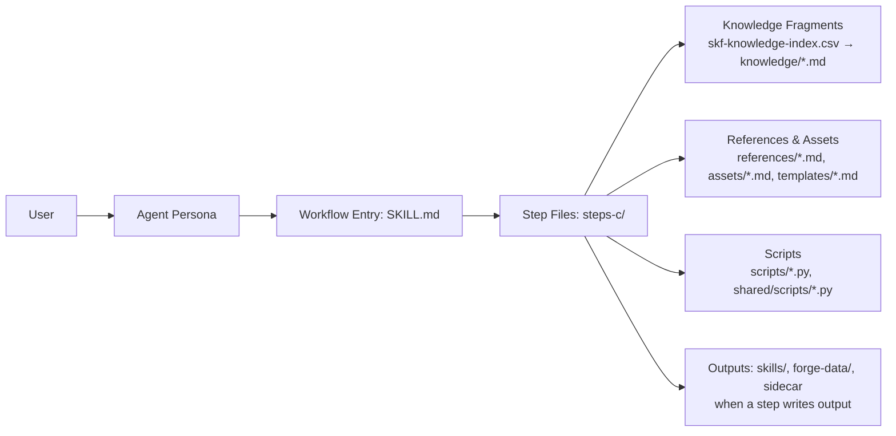

Skill Forge runs entirely inside the LLM context window through structured instructions. There is no external orchestrator — just an agent persona (Ferris), a set of workflows, and a curated knowledge base. This page covers the machinery. For an end-to-end walkthrough, see [How It Works](../how-it-works/). For what a skill contains, see [Skill Model](../skill-model/).

---

## How BMAD Works

[BMAD](https://docs.bmad-method.org/) tackles complex, open-ended work by decomposing it into **repeatable workflows**. Every workflow is a sequence of small, explicit steps, so the AI takes the same route on every run. A **shared knowledge base** of standards and patterns backs those steps, keeping outputs consistent instead of improvised. The formula is simple: **structured steps + shared standards = reliable results**.

SKF plugs into BMAD the same way a specialist plugs into a team. It uses the same step-by-step workflow engine and shared standards, but focuses exclusively on skill compilation and quality assurance.

---

## Building Blocks

Each workflow directory contains these files, and each has a specific job:

| File                      | What it does                                                                                                        | When it loads                                     |
|---------------------------|---------------------------------------------------------------------------------------------------------------------|---------------------------------------------------|
| `SKILL.md`                | Human-readable entry point — goals, role definition, initialization sequence, invocation contract, routes to first step | Entry point per workflow                          |
| `steps-c/*.md`            | **Create** steps — primary execution, 4–10 sequential files per workflow (the last one always chains to the shared health check) | One at a time (just-in-time)                      |
| `references/*.md`         | Workflow-specific reference data — rules, patterns, protocols                                                       | Read by steps on demand                           |
| `assets/*.md`             | Workflow-specific output formats — schemas, templates, heuristics                                                   | Read by steps on demand                           |
| `templates/*.md`          | Output skeletons with placeholder vars — steps fill these in to produce the final artifact                          | Read by steps when generating output              |
| `scripts/*.py`            | Deterministic Python scripts — scoring, validation, structural diffing, manifest operations                         | Invoked by steps via `uv run` for reproducible computation |

**Module-level shared files** (not per-workflow — loaded by the agent or referenced across workflows):

| File                      | What it does                                                                                                        | When it loads                                     |
|---------------------------|---------------------------------------------------------------------------------------------------------------------|---------------------------------------------------|
| `skf-forger/SKILL.md`     | Expert persona — identity, principles, critical actions, menu of triggers                                           | First — always in context                         |
| `knowledge/skf-knowledge-index.csv` | Knowledge fragment index — id, name, tags, tier, file path                                                          | Read by steps to decide which fragments to load   |
| `knowledge/*.md`          | 14 reusable fragments + overview.md index — cross-cutting principles and patterns (e.g., `zero-hallucination.md`, `confidence-tiers.md`, `ccc-bridge.md`) | Selectively read into context when a step directs |
| `shared/scripts/*.py`     | 7 cross-workflow Python scripts — preflight checks, manifest ops, managed-section rebuilds, frontmatter validation, severity classification, structural diffing, skill inventory | Invoked by any workflow that needs deterministic computation |



## Runtime flow

1. **Trigger** — User types `@Ferris CS` (or fuzzy match like `create-skill`). The agent menu in `skf-forger/SKILL.md` maps the trigger to the workflow path.
2. **Agent loads** — `skf-forger/SKILL.md` injects the persona (identity, principles, critical actions) into the context window. Sidecar files (`forge-tier.yaml`, `preferences.yaml`) are loaded for persistent state.
3. **Workflow loads** — `SKILL.md` presents the mode choice and routes to the first step file.
4. **Step-by-step execution** — Only the current step file is in context (just-in-time loading). Each step explicitly names the next one. The LLM reads, executes, saves output, then loads the next step. No future steps are ever preloaded.
5. **Sub-agent delegation** — When a step needs to process large files (full `SKILL.md` documents, multiple `references/*.md` files, parallel per-library extraction), it spawns sub-agents via the Agent tool instead of loading the content into the parent context. Each sub-agent receives a file path, extracts a compact JSON summary, and returns it. Up to 8 sub-agents run concurrently. The parent collects JSON summaries without ever loading the full source — context isolation by design, preventing one step's data from bloating the window for the next. Used in TS (coverage check), RA (gap analysis), VS (integration verification), AS (structural diff), and SS (parallel extraction).
6. **Knowledge injection** — Steps consult `skf-knowledge-index.csv` and selectively load fragments from `knowledge/` by tags and relevance. Cross-cutting principles (zero hallucination, confidence tiers, provenance) are loaded only when a step directs — not preloaded.
7. **Reference and asset injection** — Steps read `references/*.md` and `assets/*.md` files as needed (rules, patterns, schemas, heuristics). This is deliberate context engineering: only the data relevant to the current step enters the context window.
8. **Script execution** — Steps invoke deterministic Python scripts (`scripts/*.py`, `shared/scripts/*.py`) via `uv run` for computation that must be reproducible: scoring, structural diffing, manifest operations, frontmatter validation. The LLM prepares inputs, the script computes, the LLM uses the output. Same inputs always produce the same result.
9. **Templates** — When a step produces output (e.g., a skill brief or test report), it reads the template file and fills in placeholders with computed results. The template provides consistent structure; the step provides the content.
10. **Progress tracking** — Each step appends to an output file with state tracking. Resume mode reads this state and routes to the next incomplete step.

## Ferris Operating Modes

Ferris operates in five workflow-driven modes (mode is determined by which workflow is running, not conversation state):

| Mode          | Workflows          | Behavior                                                    |
|---------------|--------------------|-------------------------------------------------------------|
| **Architect** | SF, AN, BS, CS, QS, SS, RA | Exploratory, assembling, refining — discovers structure, scopes skills, and improves architecture |
| **Surgeon**   | US                 | Precise, semantic diffing — preserves [MANUAL] sections during regeneration |
| **Audit**     | AS, TS, VS         | Judgmental, scoring — evaluates quality and detects drift   |
| **Delivery**  | EX                 | Validates package, generates snippets, injects into context files |
| **Management** | RS, DS            | Transactional rename/drop — copy-verify-delete with platform context rebuild |

---

## Tool Ecosystem

### 7 Tools

| Tool | Wraps | Purpose |
|------|-------|---------|
| **`gh_bridge`** | GitHub CLI (`gh`) | Source code access, issue mining, release tracking, PR intelligence |
| **`skill-check`** | [thedaviddias/skill-check](https://github.com/thedaviddias/skill-check) | Validation + auto-fix (`check --fix`), quality scoring (0-100), security scan, split-body, diff comparison |
| **`tessl`** | [tessl](https://tessl.io) | Content quality review, actionability scoring, progressive disclosure evaluation, AI judge with suggestions |
| **`ast_bridge`** | ast-grep CLI | Structural extraction, custom AST queries, co-import detection |
| **`ccc_bridge`** | cocoindex-code | Semantic code search, project indexing, file discovery pre-ranking |
| **`qmd_bridge`** | QMD (local search) | BM25 keyword search, vector semantic search, collection indexing |
| **`doc_fetcher`** | Environment web tools | Remote documentation fetching for T3-confidence content. Tool-agnostic — uses whatever web fetching is available (Firecrawl, WebFetch, curl, etc.). Output quarantined as T3. |

Bridge names are **conceptual interfaces** used throughout workflow steps. Each bridge resolves to concrete MCP tools, CLI commands, or fallback behavior depending on the IDE environment. See [`src/knowledge/tool-resolution.md`](https://github.com/armelhbobdad/bmad-module-skill-forge/blob/main/src/knowledge/tool-resolution.md) for the complete resolution table.

### Conflict Resolution

When tools disagree, higher priority wins for instructions. Lower priority is preserved as annotations:

| Priority | Source | Tool |
|----------|--------|------|
| 1 (highest) | AST extraction | `ast_bridge` |
| 1b | CCC discovery (pre-ranking) | `ccc_bridge` |
| 2 | QMD evidence | `qmd_bridge` |
| 3 | Source reading (non-AST) | `gh_bridge` |
| 4 | External documentation | `doc_fetcher` |

### Manifest Detection

Stack skill workflows detect project dependencies by scanning for manifest files. This isn't a tool — it's a reference pattern ([`skf-create-stack-skill/references/manifest-patterns.md`](https://github.com/armelhbobdad/bmad-module-skill-forge/blob/main/src/skf-create-stack-skill/references/manifest-patterns.md)) consulted by workflow steps:

| Ecosystem | Manifest Files |
|-----------|----------------|
| JavaScript / TypeScript | `package.json` |
| Python | `requirements.txt`, `setup.py`, `pyproject.toml`, `Pipfile` |
| Rust | `Cargo.toml` |
| Go | `go.mod` |
| Java | `pom.xml`, `build.gradle` |
| Ruby | `Gemfile` |
| PHP | `composer.json` |
| .NET | `*.csproj` |

Detection runs at depth 0-1 from project root, excluding dependency trees (`node_modules/`, `.venv/`, `vendor/`), build output (`dist/`, `target/`, `__pycache__/`), and VCS directories.

---

## Workspace Artifacts

Build artifacts are committable — another developer can reproduce the same skill:

```
forge-data/{skill-name}/
├── skill-brief.yaml        # Compilation config (version-independent)
└── {version}/
    ├── provenance-map.json     # Source map with AST bindings
    ├── evidence-report.md      # Build audit trail
    └── extraction-rules.yaml   # Language-specific ast-grep schema
```

The `provenance-map.json` includes per-export `entries` with a `source_library` field identifying which library each export belongs to. For stack skills, it also includes an `integrations` array (cross-library patterns) and a `constituents` array (compose-mode only — tracks the compose-time snapshot of each source skill for staleness detection via metadata hash comparison). The `file_entries` array handles script/asset file-level provenance (SHA-256 hashes, source paths).

### Pipeline Result Contracts

Pipeline-facing workflows write a machine-readable result JSON file alongside their human-readable output. This enables reliable CI integration and pipeline chaining — downstream workflows or scripts can verify what the prior step produced without parsing markdown. Each run writes two files: a timestamped per-run record (`{skill-name}-result-{YYYYMMDD-HHmmss}.json`) that preserves the full audit trail across retries and aborts, and a stable `{skill-name}-result-latest.json` copy that pipeline consumers read without enumerating timestamps. The schema follows a consistent format: `skill`, `status` (success/failed/partial), `timestamp`, `outputs` (array of produced artifacts with type and path), and a skill-specific `summary` object.

`skills/` and `forge-data/` are committed. Agent memory (`_bmad/_memory/forger-sidecar/`) is gitignored.

---

## Knowledge Base

SKF relies on a curated skill compilation knowledge base:

- Index: [`src/knowledge/skf-knowledge-index.csv`](https://github.com/armelhbobdad/bmad-module-skill-forge/blob/main/src/knowledge/skf-knowledge-index.csv)
- Fragments: [`src/knowledge/`](https://github.com/armelhbobdad/bmad-module-skill-forge/tree/main/src/knowledge)

Workflows load only the fragments required for the current task to stay focused and compliant.

---

## Module Structure

```
src/
├── skf-forger/               # Agent skill (SKILL.md + manifest)
├── skf-setup/                # Setup skill (forge initialization)
├── skf-analyze-source/
├── skf-brief-skill/
├── skf-create-skill/
├── skf-quick-skill/
├── skf-create-stack-skill/
├── skf-verify-stack/
├── skf-refine-architecture/
├── skf-update-skill/
├── skf-audit-skill/
├── skf-test-skill/
├── skf-export-skill/
├── skf-rename-skill/
├── skf-drop-skill/
├── forger/
│   ├── forge-tier.yaml
│   ├── preferences.yaml
│   └── README.md
├── knowledge/
│   ├── skf-knowledge-index.csv
│   └── *.md (14 knowledge fragments + overview.md index)
├── shared/                   # Cross-workflow resources
├── module.yaml               # Module metadata (code, name, config vars)
└── module-help.csv           # Skill menu for bmad-help integration
```

---

## Security

- All tool wrappers use array-style subprocess execution — no shell interpolation
- Input sanitization: allowlist characters for repo names, file paths, patterns
- File paths validated against project root (no directory traversal)
- **Source code never leaves the machine.** All processing is local (AST, QMD, validation).
- `doc_fetcher` informs users which URLs will be fetched externally before processing

---

## Ecosystem Alignment

SKF produces skills compatible with the [agentskills.io](https://agentskills.io) ecosystem:

- Full [specification](https://agentskills.io/specification) compliance
- Distribution via [`npx skills add/publish`](https://www.npmjs.com/package/skills)
- Compatible with [agentskills/agentskills](https://github.com/agentskills/agentskills) and [vercel-labs/skills](https://github.com/vercel-labs/skills)

---

## Appendix: Key Design Decisions

| Decision | Rationale |
|----------|-----------|
| **Solo agent (Ferris), not multi-agent** | One domain (skill compilation) doesn't benefit from handoffs. Shared knowledge base (AST patterns, provenance maps) is the core asset. |
| **Workflows drive modes, not conversation** | Ferris doesn't auto-switch based on question content. Invoke a workflow to change mode. Predictable behavior. |
| **Hub-and-spoke cross-knowledge** | Each skill covers one source repository. Stack skills compose cross-library integration patterns in `references/integrations/`, citing each library's own skill. |
| **Stack skill = compositional** | SKILL.md is the integration layer. references/ contains per-library + integration pairs. Partial regeneration on dependency updates. |
| **Snippet updates only at export** | Create/update write a draft `context-snippet.md` to `skills/`. Export regenerates the final `context-snippet.md` and publishes it to the platform context file (CLAUDE.md/AGENTS.md/.cursorrules). No managed-section updates in draft workflows. |
| **Bundle spec, version-pin at release** | Offline-capable. SKF ships with a vendored agentskills.io spec pinned at release time; spec drift is a maintainer concern handled at SKF release, not a runtime concern for users. |
