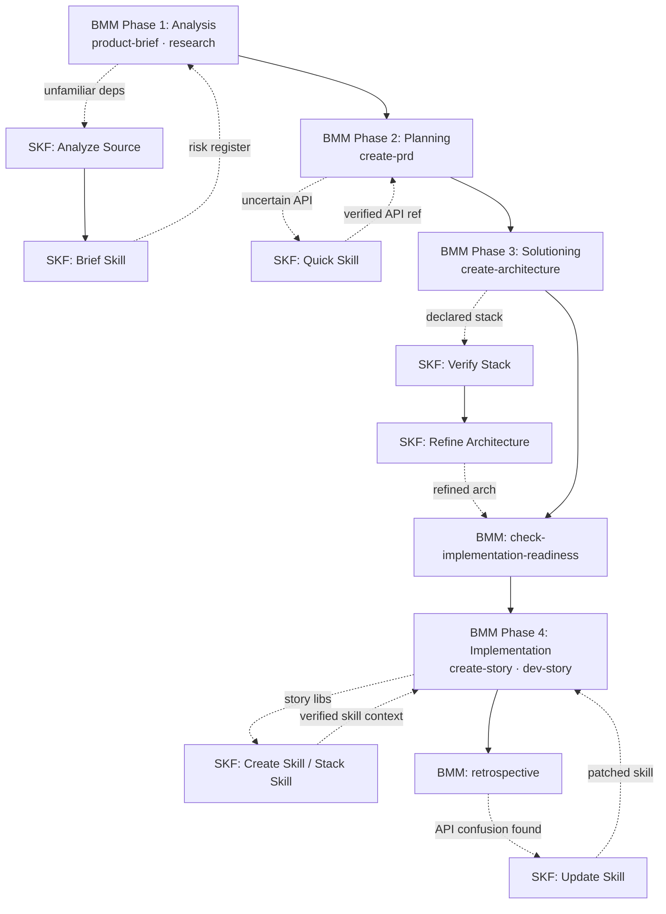
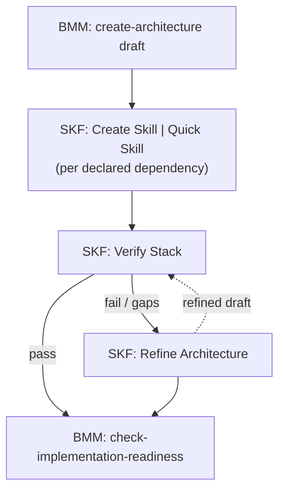
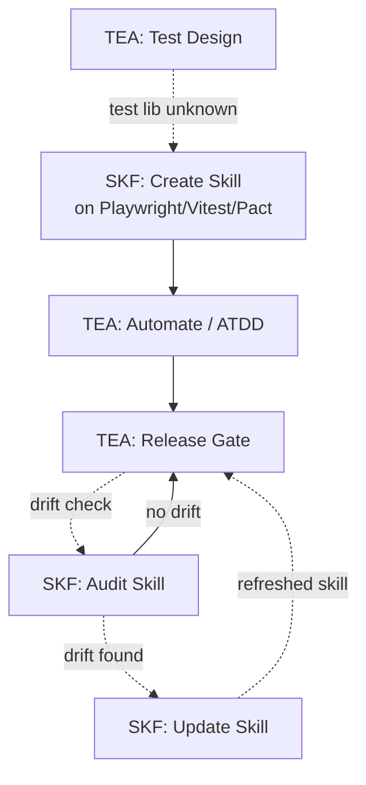

This page builds on BMAD concepts (BMM phases, TEA, modules). New to BMAD? Start with the [BMAD docs](https://docs.bmad-method.org/) first. New to SKF? Read [Getting Started](../getting-started/) instead.

---

## Launcher Skills vs Content Skills

A BMAD project that also uses SKF ends up with two different kinds of `SKILL.md` files living in the same IDE skills directory. SKF supports 23 IDEs — Claude Code (`.claude/skills/`), Cursor (`.cursor/skills/`), GitHub Copilot (`.github/skills/`), Windsurf (`.windsurf/skills/`), Cline (`.cline/skills/`), Roo Code (`.roo/skills/`), Gemini CLI (`.gemini/skills/`), and 16 others — each with its own skill directory. See the [complete IDE → Context File mapping](https://github.com/armelhbobdad/bmad-module-skill-forge/blob/main/src/skf-export-skill/assets/managed-section-format.md) for the full list. They look similar. They are not the same thing. This is the single most durable point of confusion, so get it straight up front.

| | BMAD launcher skill | SKF content skill |
|---|---|---|
| **Created by** | `npx bmad-method install` (when you pick a module) | `@Ferris CS` / `QS` / `SS` |
| **File contains** | A thin wrapper that loads a BMAD workflow, agent, or task | The instructions themselves, with citations to real source code |
| **Updates when** | You reinstall or upgrade BMAD | You re-run SKF compilation against a new upstream version |
| **Provenance** | Points to a BMAD workflow file inside `_bmad/` | Points to upstream repo commits, files, and line ranges |
| **Example** | `bmad-create-prd/SKILL.md` loads a PRD workflow | `hono-4.6.0/SKILL.md` contains verified Hono API signatures |

> BMAD skills *launch workflows*. SKF skills *are the workflows' output, frozen with citations*. Both coexist in the same IDE skills directory on purpose.

When a BMAD agent runs a workflow, that workflow can consult SKF content skills for verified API knowledge. The two kinds of skills compose — they don't compete.

---

## SKF and BMM: Phase-by-Phase Playbook

BMM is BMAD's core [4-phase workflow](https://docs.bmad-method.org/) (Analysis → Planning → Solutioning → Implementation). SKF has five concrete entry points across those phases. The diagram below shows the end-to-end picture; the subsections that follow give the trigger, command, and artifact flow for each phase.

### Phase 1 — Analysis

**Trigger:** A brownfield repo or an unfamiliar third-party dependency surfaces during `product-brief` or `research`. The team can't answer "what does this library actually expose?" from training data.

**SKF command:** `@Ferris AN` on the repo, then `@Ferris BS` to scope each priority library.

**What flows back:** Recommended skill boundaries, an analysis report of the discovered units, and one skill-brief per library that's ready to compile later. The scoping data is what PMs typically feed into their own risk register.

**Why now, not later:** Catching surprise libraries during Analysis keeps the PRD honest. Discovering the same unknowns during Implementation forces course corrections that a two-paragraph risk entry could have prevented.

### Phase 2 — Planning

**Trigger:** The PRD draft references an API and you realize nobody on the team is 100% sure how it behaves.

**SKF command:** `@Ferris QS <package>` — no brief needed.

**What flows back:** A verified skill you can cite directly in acceptance criteria. PM and architect read the same source.

**Why now, not later:** Quick Skill is cheap insurance. It takes under a minute and prevents a whole class of "actually that function doesn't exist" moments during story writing.

### Phase 3 — Solutioning

This is the highest-value integration. BMM's architect agent works from assumptions about the declared stack; SKF is how those assumptions become evidence-backed before the team commits to an implementation readiness check.

**Trigger:** Architecture draft exists, `check-implementation-readiness` hasn't run yet.

**SKF commands:** `@Ferris QS <library>` per declared dependency, then `@Ferris VS`, then `@Ferris RA` on any gaps or failures.

**What flows back:** A pass/fail feasibility report per component, version-pinned evidence for every claim, and a refined architecture document with verified API signatures filled in at the callout points.

**Why now, not later:** Running VS after Implementation has started means your stories are already built on an unverified foundation. The loop below is designed to iterate cheaply *before* code gets written.

The "Pre-Code Architecture Verification — Greenfield Confidence" scenario in [Examples](../examples/) walks through a concrete case of this loop.

### Phase 4 — Implementation

Two distinct triggers fire during Implementation, one at the start of each story and one after each retrospective.

**Trigger A (before `create-story`):** The story touches a library whose API isn't already in a content skill.

**SKF command:** `@Ferris CS` for a single library, or `@Ferris SS` when the story spans several dependencies.

**What flows back:** A verified content skill the `dev-story` workflow can consult during implementation — no training-data guessing about function signatures.

**Trigger B (after `retrospective`):** The retro flagged something like "we kept getting API X wrong this sprint."

**SKF command:** `@Ferris US` on the affected skill.

**What flows back:** A patched skill with the newly-discovered edge cases captured — `[MANUAL]` sections preserved so human annotations aren't overwritten. Next sprint's stories consume the updated skill automatically.

This retrospective → update loop is the pattern that [Scenario A in Examples](../examples/#scenario-a-greenfield--bmm-integration) sketches for one project; it generalizes to any BMM project that runs more than a few sprints.

---

## SKF with Optional BMAD Modules

BMAD ships several [optional modules](https://github.com/orgs/bmad-code-org/repositories). Synergy with SKF ranges from very high (TEA) to narrow (CIS). This section is honest about both.

### TEA — Test Architect

TEA produces structured test strategies and release gates. SKF produces the verified skills TEA's workflows need when the test target is a library they don't fully know.

Two concrete integrations:

- **Before Test Design / ATDD / Automate / Framework Scaffolding** — run `@Ferris CS` on whichever test library the strategy depends on (Playwright, Vitest, Pact, etc.). TEA's test-authoring agents then work against verified API surfaces instead of training-data approximations.
- **Before Release Gate** — run `@Ferris AS` on the skills the gate cites. If the skill has drifted from the current source, the drift report itself becomes evidence the gate can act on, and `@Ferris US` closes the loop.

### BMB — BMAD Builder

BMB authors extend BMAD with new agents, workflows, or entire modules. SKF itself was built using BMB — it's a living proof-of-concept for the BMAD module architecture. When a new module depends on third-party libraries, ship a verified companion skill alongside it:

- During `module-builder`, run `@Ferris SS` on the module's declared stack. The resulting stack skill becomes part of the module's distribution — downstream users get both the BMAD module BMB built and the SKF content skill you compiled as its companion in a single install.

### GDS — Game Dev Studio

Narrow synergy. GDS covers GDD authoring, narrative design, and engine-specific guidance for 21+ game types, and most of that is conceptual work with no code to verify. The exception is when the GDD commits to a concrete engine SDK (Bevy, Godot-Rust, Unity DOTS):

- Once the engine binding is pinned, run `@Ferris CS` on it. The implementation team then has verified bindings to work against.

For narrative, character design, world-building, or genre research — no synergy. SKF has nothing to offer the creative side of GDS.

### CIS — Creative Intelligence Suite

Narrow but real synergy during the **brief-skill** phase. CIS's brainstorming coach, advanced elicitation, and party mode can sharpen scope decisions before compilation begins — especially when briefing a skill for a library you don't know well, or when multiple stakeholders disagree on what the skill should cover. The [oh-my-skills](https://github.com/armelhbobdad/oh-my-skills) repository uses BMAD Core + CIS alongside SKF: when briefing [`oms-storybook-react-vite`](https://github.com/armelhbobdad/oh-my-skills/blob/main/forge-data/oms-storybook-react-vite/skill-brief.yaml), CIS brainstorming, party mode, and advanced elicitation helped narrow a massive repo (Storybook supports Next.js, Astro, SvelteKit, and more — with extensive documentation for each) down to an accurate brief scoped specifically to React + Vite.

Beyond briefing, CIS and SKF don't overlap — CIS covers ideation, storytelling, and innovation strategy where there's no code to verify. Use CIS for the creative and strategic work, then bring SKF in once you're producing concrete technical artifacts.

---

## Delivery and Lifecycle in a BMAD Project

`@Ferris EX` is the **only workflow that introduces new skill context** into the three context files that serve all 23 IDEs: `CLAUDE.md` (Claude Code), `.cursorrules` (Cursor), and `AGENTS.md` (the remaining 21 IDEs — GitHub Copilot, Windsurf, Cline, Roo Code, Gemini CLI, and others). Each IDE also has its own skill root directory where skill files are installed (e.g., `.windsurf/skills/`, `.roo/skills/`, `.gemini/skills/`). Create-skill and update-skill produce draft artifacts that never touch those files directly — nothing reaches an agent's passive context until it has been through the EX gate. See [Skill Model → Dual-Output Strategy](../skill-model/#dual-output-strategy) for the architectural rationale.

This matters specifically in a BMAD project: you may have multiple BMAD modules, each with its own launcher skills, plus SKF content skills, all trying to contribute context. The write-guard means only verified, tested SKF skills ever reach an agent's passive context — nothing half-baked sneaks in. `@Ferris EX` injects managed sections that coexist cleanly with whatever BMAD's installer wrote in the same files.

For long-running BMAD projects, `@Ferris RS` (rename) and `@Ferris DS` (drop) keep the skill inventory clean as libraries get swapped, versions get deprecated, or naming conventions evolve across sprints. Both *rebuild* the existing managed sections in those context files so references stay consistent after a rename or drop — they never inject previously-unpublished content, so the EX gate still governs what initially enters those files.

---

## Where to Go Next

- [BMAD docs](https://docs.bmad-method.org/) — canonical reference for BMM phases, TEA workflows, BMB / GDS / CIS details, and the full module list
- [Workflows](../workflows/) — complete SKF workflow reference with commands and connection diagrams
- [Examples](../examples/) — concrete scenarios including the BMM retrospective loop and greenfield architecture verification
