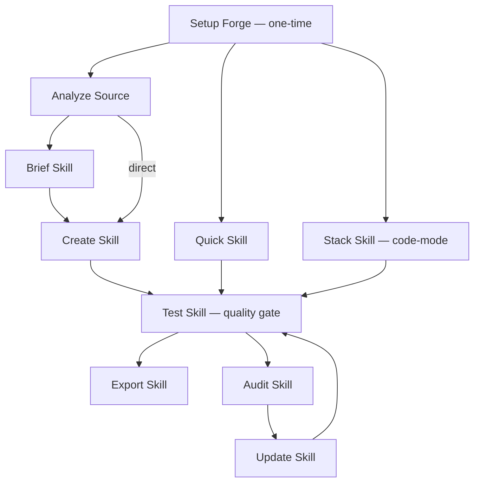
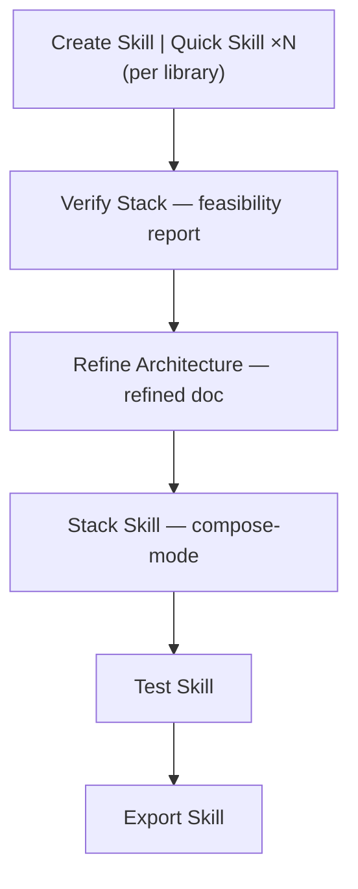

Trigger workflows by typing commands to [Ferris](../agents/). See [Concepts](../concepts/) for definitions.

> Already using BMAD? See [BMAD Synergy](../bmad-synergy/) for when to invoke each SKF workflow during BMM phases and alongside TEA, BMB, and GDS.

---

## Core Workflows

### Setup Forge (SF)

**Command:** `@Ferris SF`

**Purpose:** Initialize forge environment, detect tools (ast-grep, ccc, gh, qmd), set capability tier, index project in CCC (Forge+), verify QMD collection health (Deep).

**When to Use:** First time using SKF in a project. Run once per project.

**Key Steps:** Detect tools + Determine tier → CCC index check (Forge+) → Write forge-tier.yaml → QMD + CCC registry hygiene (Deep/Forge+) → Status report

**Agent:** Ferris (Architect mode)

---

### Brief Skill (BS)

**Command:** `@Ferris BS`

**Purpose:** Scope and design a skill through guided discovery.

**When to Use:** Before `Create Skill` when you want maximum control over what gets compiled.

**Key Steps:** Gather intent → Analyze target → Define scope → Confirm brief → Write skill-brief.yaml

**Agent:** Ferris (Architect mode)

---

### Create Skill (CS)

**Command:** `@Ferris CS`

**Purpose:** Compile a skill from a brief. Supports `--batch` for multiple briefs.

**When to Use:** After Brief Skill, or with an existing skill-brief.yaml.

**Key Steps:** Load brief → Ecosystem check → Extract (AST + scripts/assets) → QMD enrich (Deep) → Compile → Validate → Generate

**Agent:** Ferris (Architect mode)

---

### Update Skill (US)

**Command:** `@Ferris US`

**Purpose:** Regenerates the skill while preserving `[MANUAL]` sections. Detects individual vs stack internally.

**When to Use:** After source code changes when an existing skill needs updating.

**Key Steps:** Load existing → Detect changes (incl. scripts/assets) → Re-extract → Merge (preserve MANUAL) → Validate → Write → Report

**Agent:** Ferris (Surgeon mode)

---

## Feature Workflows

### Quick Skill (QS)

**Command:** `@Ferris QS <package-or-url>` or `@Ferris QS <package-or-url>@<version>`

**Purpose:** Brief-less fast skill with package-to-repo resolution.

**When to Use:** When you need a skill quickly — no brief needed. Accepts package names or GitHub URLs. Append `@version` to target a specific version (e.g., `@Ferris QS cognee@1.0.0`).

**Key Steps:** Resolve target → Ecosystem check → Quick extract → Compile → Validate → Write

**Agent:** Ferris (Architect mode)

---

### Stack Skill (SS)

**Command:** `@Ferris SS`

**Purpose:** Consolidated project stack skill with integration patterns. Supports two modes: **code-mode** (analyzes a codebase) and **compose-mode** (synthesizes from existing skills + architecture document, no codebase required).

**When to Use:** When you want your agent to understand your entire project stack — not just individual libraries. Use code-mode for existing projects; compose-mode activates automatically after the VS → RA verification path when skills exist but no codebase is present.

**Key Steps (code-mode):** Detect manifests → Rank dependencies → Scope confirmation → Parallel extract → Detect integrations → Compile stack → Generate references

**Key Steps (compose-mode):** Load existing skills → Confirm scope → Detect integrations from architecture doc → Compile stack → Generate references

**Agent:** Ferris (Architect mode)

---

### Analyze Source (AN)

**Command:** `@Ferris AN`

**Purpose:** Decomposes a repo to discover what's worth skilling, and recommends a stack skill.

**When to Use:** Brownfield onboarding of large repos or multi-service projects.

**Key Steps:** Init → Scan project → Identify units → Map exports & detect integrations → Recommend → Generate briefs

**Note:** Supports resume — if the session is interrupted mid-analysis, re-run `@Ferris AN` and Ferris will resume from where it left off.

**Agent:** Ferris (Architect mode)

---

### Audit Skill (AS)

**Command:** `@Ferris AS`

**Purpose:** Drift detection between skill and current source.

**When to Use:** To check if a skill has fallen out of date with its source code. Works for both individual skills and stack skills.

**Key Steps:** Load skill → Re-index source → Structural diff (incl. script/asset drift) → Semantic diff (Deep) → Classify severity → Report

**Stack skill support:** Code-mode stacks are audited per-library against their sources. Compose-mode stacks check constituent freshness via metadata hash comparison — if a constituent skill was updated after the stack was composed, audit flags it as constituent drift. Stack skills that need updating are redirected to `@Ferris SS` for re-composition (surgical update is not supported for stacks).

**Agent:** Ferris (Audit mode)

---

### Test Skill (TS)

**Command:** `@Ferris TS`

**Purpose:** Verifies whether a skill covers its target completely and accurately. Naive and contextual modes. Quality gate before export.

**When to Use:** After creating or updating a skill, before exporting.

**Key Steps:** Load skill → Detect mode → Coverage check → Coherence check → External validation (skill-check, tessl) → Score → Gap report

**Scored Categories:** Export Coverage (36%), Signature Accuracy (22%), Type Coverage (14%), Coherence (18%), External Validation (10%). Default pass threshold: **80%**. Pass routes to Export Skill; fail routes to Update Skill with a gap report. See [Completeness Scoring](../verifying-a-skill/#how-the-score-is-computed) for the full formula and tier adjustments.

**Agent:** Ferris (Audit mode)

---

## Architecture Verification Workflows

### Verify Stack (VS)

**Command:** `@Ferris VS`

**Purpose:** Pre-code stack feasibility verification. Cross-references generated skills against architecture and PRD documents with three passes: coverage, integration compatibility, and requirements.

**When to Use:** After generating individual skills with CS/QS, before building a stack skill — to verify the tech stack can support the architecture.

**Key Steps:** Load skills + docs → Coverage analysis → Integration verification → Requirements check → Synthesize verdict → Present report

**Agent:** Ferris (Audit mode)

---

### Refine Architecture (RA)

**Command:** `@Ferris RA`

**Purpose:** Improves an architecture document using verified skill data as evidence. Takes the original architecture doc + generated skills + optional VS report, fills gaps, flags contradictions, and suggests improvements — all citing specific APIs.

**When to Use:** After VS confirms feasibility, before running SS in compose-mode. Produces a refined architecture ready for stack skill composition.

**Key Steps:** Load inputs → Gap analysis → Issue detection → Improvement detection → Compile refined doc → Present report

**Agent:** Ferris (Architect mode)

---

## Utility Workflows

### Export Skill (EX)

**Command:** `@Ferris EX`

**Purpose:** Validate package structure, generate context snippets, and inject managed sections into CLAUDE.md/AGENTS.md/.cursorrules.

**When to Use:** When a skill is ready for CLAUDE.md/AGENTS.md integration. Also provides a local install command (`npx skills add <path>`) and distribution instructions for `npx skills publish`. See [Installation → Source Formats](https://www.npmjs.com/package/skills#installation) for other install methods.

**Key Steps:** Load skill → Validate package → Generate snippet → Update context file (CLAUDE.md/AGENTS.md/.cursorrules) → Token report → Summary

**Agent:** Ferris (Delivery mode)

---

## Management Workflows

### Rename Skill (RS)

**Command:** `@Ferris RS`

**Purpose:** Rename a skill across all its versions. Because the agentskills.io spec requires `name` to match parent directory name, this is a coordinated move across outer/inner directories, SKILL.md frontmatter, metadata.json, context snippets, provenance maps, the export manifest, and platform context files.

**When to Use:** You need to change a skill's name — for example, graduating a `QS`-generated skill (named from the repo) to a formal name, or adding a suffix like `-community` to distinguish from an official skill.

**Key Steps:** Select skill + new name → Transactional copy → Update all references → Rebuild context files → Delete old name (point of no return)

**Safety:** Transactional — if any step fails before the final delete, the old skill remains intact. Warns if `source_authority: "official"` (rename is local-only; published registry skill won't change).

**Agent:** Ferris (Management mode)

---

### Drop Skill (DS)

**Command:** `@Ferris DS`

**Purpose:** Drop a specific skill version or an entire skill. Soft drop (default) marks the version as deprecated in the manifest and keeps files on disk. Hard drop (`--purge`) also deletes the files.

**When to Use:** Retire a deprecated version (e.g., drop an older cognee skill version because it's obsolete), free disk space, or remove a skill you no longer need.

**Key Steps:** Select skill → Select version(s) + mode → Update manifest → Rebuild context files → Delete files (if purge)

**Safety:** Active version guard — cannot drop the currently active version when other non-deprecated versions exist (switch active first, or drop all). Soft drop is reversible by editing the manifest.

**Agent:** Ferris (Management mode)

---

## Workflow Connections

**Standard path (code-mode):**



**Pre-code verification path (compose-mode):**



> **One workflow per session** (unless using pipeline mode). Each arrow in the diagrams above represents a new conversation session. Clear your context between workflows for best results — or use pipeline mode to chain them automatically. See [Pipeline Mode](#pipeline-mode) below.

---

## Workflow Categories

| Category | Workflows | Description |
|----------|-----------|-------------|
| Core | SF, BS, CS, US | Setup, brief, create, and update skills |
| Feature | QS, SS, AN | Quick skill, stack skill, and analyze source |
| Quality | AS, TS | Detect skill drift (AS) and verify skill completeness (TS) |
| Architecture Verification | VS, RA | Pre-code architecture feasibility and refinement |
| Management | RS, DS | Rename and drop skill versions with transactional safety |
| Utility | EX | Package and export for consumption |
| In-Agent | WS, KI | WS: show lifecycle position, active briefs, and forge tier; KI: list knowledge fragments (both in-agent, no file-based workflow) |

---

## Pipeline Mode

Instead of running one workflow per session, you can chain multiple workflows in a single command. Ferris executes them left to right, passing data (brief path, skill name) between each workflow automatically.

### Syntax

```
@Ferris BS CS TS EX                    — space-separated codes
@Ferris QS[cocoindex] TS EX            — with target argument in brackets
@Ferris CS TS[min:80] EX               — with circuit breaker threshold override
@Ferris forge-quick cognee             — named alias with target
```

### Pipeline Aliases

| Alias | Expands To | First Workflow | Required Target |
|-------|-----------|----------------|-----------------|
| `forge` | `BS CS TS EX` | BS | GitHub URL or local path **+** skill name |
| `forge-quick` | `QS TS EX` | QS | GitHub URL **or** package name |
| `onboard` | `AN CS TS EX` | AN | Project path (defaults to current directory) |
| `maintain` | `AS US TS EX` | AS | Existing skill name |

**The first workflow's input contract defines what arguments the pipeline needs.** A bare package name works for `forge-quick` (QS resolves packages via the registry) but **not** for `forge` — BS requires both an unambiguous target (URL or path) and a skill name.

### How It Works

- Pipelines **automatically activate headless mode** — all confirmation gates auto-proceed with their default action
- **Data flows automatically** — once the first workflow completes, the brief path or skill name becomes the input for downstream workflows
- **Circuit breakers** halt the pipeline if quality drops below a threshold (e.g., test score < 60 blocks export)
- **Anti-pattern warnings** — Ferris warns if you chain workflows in a problematic order (e.g., exporting before testing)
- **Progress reporting** — Ferris reports completion of each workflow before starting the next
- **Safe halt on ambiguity** — headless mode won't guess. If the initial target doesn't satisfy the first workflow's contract (e.g., `forge cognee` — ambiguous, not a URL or path), the pipeline halts at step 1 before any work happens and suggests concrete next steps.

### Examples

```
@Ferris forge-quick @tanstack/query                                  — QS + TS + EX for TanStack Query
@Ferris forge https://github.com/topoteretes/cognee cognee           — BS + CS + TS + EX, explicit URL + name
@Ferris forge https://github.com/topoteretes/cognee cognee "public API only"   — with scope hint
@Ferris maintain cocoindex                                           — AS + US + TS + EX for an existing cocoindex skill
@Ferris onboard                                                      — AN + CS + TS + EX on the current project
```

---

## Headless Mode

Add `--headless` or `-H` to any workflow command to skip all confirmation gates. Ferris auto-proceeds with default actions (typically "Continue") and logs each auto-decision. Progress output is still shown — headless skips interaction, not reporting.

```
@Ferris QS cocoindex --headless  — quick skill with no interaction gates
@Ferris TS --headless             — test a skill without the review pause
@Ferris EX -H                    — export with auto-approved context update
```

You can also set `headless_mode: true` in your forge preferences (`_bmad/_memory/forger-sidecar/preferences.yaml`) to make headless the default for all workflows.

---

## Terminal Step: Health Check

All 14 workflows above share the same final step — a **health check** defined in [`src/shared/health-check.md`](https://github.com/armelhbobdad/bmad-module-skill-forge/blob/main/src/shared/health-check.md). This isn't a workflow you invoke directly; there's no command code and no menu entry. Each workflow ends with a dedicated local `step-NN-health-check.md` whose `nextStepFile` points at the shared file, so the health check fires automatically once the main work is done. After the main work is done, Ferris reflects internally on the execution:

- Did any step instruction lead the agent astray or cause unnecessary back-and-forth?
- Was any step ambiguous, forcing the agent to guess?
- Did a scenario arise that the workflow didn't account for?
- Were any instructions wrong or contradictory?

If the answer to all of these is "no", the health check exits in one line (`Clean run. No workflow issues to report.`). If real friction was observed, Ferris presents structured findings, waits for your review, and — on your approval — routes them to this repo.

**Zero overhead for clean runs. High leverage when something breaks.** The health check is honest-by-default: zero findings is the expected outcome. Fabricated issues would hurt the signal, so Ferris only reports what the agent actually experienced.

### How findings are routed

- **Severity gate.** Only `bug` findings submit live as GitHub issues by default. `friction` and `gap` findings — the most subjective categories — go to a **local queue** at `{output_folder}/improvement-queue/` unless you explicitly opt in to submit them live during the review gate. This keeps the high-signal reports (real defects) flowing to maintainers while the softer observations sit safely on your disk for you to batch or revisit.
- **Fingerprint dedup.** Every finding gets a deterministic 7-hex fingerprint computed from `sha1(severity|workflow|step_file|section)` — no LLM similarity judgment, just a tuple hash. Before Ferris opens a new issue, it searches the repo for an existing open issue with the same `fp-*` label. If one exists, you're offered a choice: add a 👍 reaction (silent upvote), react + post a one-sentence environment delta, open a new issue anyway (if you're certain it's distinct), or skip. Re-reporting the same fingerprint is safe — it just adds to the signal-count on the canonical issue.
- **Global seen-cache.** Once you've submitted or reacted for a given fingerprint, it's recorded at `~/.skf/health-check-seen.json` so the same user never re-reports the same defect across sessions or across different projects on the same machine.
- **Server-side safety net.** If two users race past the client-side search and both open issues with the same fingerprint, a GitHub Action on this repo catches it: the later issue is auto-closed as a duplicate, linked to the canonical (lowest-numbered) issue, and a 👍 is added there to preserve the signal-count. Manual filers using the [issue template](https://github.com/armelhbobdad/bmad-module-skill-forge/issues/new/choose) feed the same pipeline.

**Net effect:** 1,000 users hitting the same bug produce **one canonical issue** with a reaction-count of roughly 1,000 — not 1,000 duplicate issues or a 1,000-comment thread. The maintainer sees population impact at a glance, and your report is never lost.

### Please let workflows run to completion

If you cancel a workflow early, or interrupt the agent before the terminal step, the health check doesn't run — and any friction from that session is lost. When you have time, let each workflow reach its natural end. The health check is how SKF learns to do better.

### If the health check didn't run

You have two recovery options:

1. **Ask Ferris to run it now** — while the session context is still fresh:

   ```
   @Ferris please run the workflow health check for this session
   ```

   Ferris will load `shared/health-check.md` and reflect on what just happened, exactly as if the workflow had reached its natural end.

2. **Open an issue directly** — use the [Workflow Health Check issue template](https://github.com/armelhbobdad/bmad-module-skill-forge/issues/new/choose) on this repo. Any concrete, evidence-based report helps — cite the specific step file and section where the friction occurred, and describe what you actually observed (not what you think the problem is).

Both paths feed the same improvement queue.

> **Note:** Some gates cannot be skipped even in headless mode — for example, merge conflicts in Update Skill always require human judgment.
